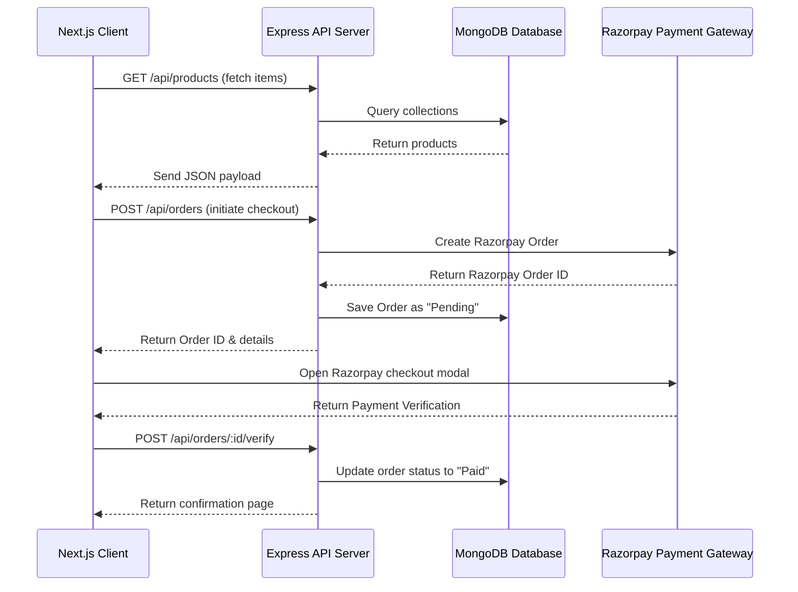

# Product Requirements Document (PRD)
## Project Name: Abaya By Tabassum (Luxury Modest Atelier)
**Author:** AI Engineering Assistant (Antigravity)  
**Date:** June 19, 2026  
**Status:** Completed & Deployed  

---

## 1. Product Overview & Vision
**Abaya By Tabassum** is a premium, bespoke e-commerce platform designed to bring high-end modesty fashion to the modern woman. The product combines an editorial-grade boutique storefront with a robust administrative backoffice panel. The primary focus is to deliver an immaculate, smooth, and high-fashion user experience through:
- Harmonic premium styling (Glassmorphism, curated luxury gold-ivory-sand palettes).
- Custom sizing selections (standard size, custom abaya length check).
- Micro-interactions (image magnification zoom lens, smooth slide-out drawers, responsive drawer panels).
- Fully structured API endpoints communicating with a MongoDB database.

---

## 2. User Roles & Access Levels
The system supports three user roles:
1. **Guest / Anonymous Visitor**: Can browse collections, lookbooks, add items to cart/wishlist, and initiate guest checkouts.
2. **Registered Customer**: Can maintain a profile dashboard, check past order histories, verify custom fitted length details, and receive automated email receipts.
3. **Admin / Super Admin**: Has exclusive access to the backoffice analytics dashboard, can add/edit/soft-delete products, check shop sales metrics, and manage active discount coupons.

---

## 3. Product Features & Functional Requirements

### 3.1 Storefront & Customer Experience

#### A. Homepage (Atelier Welcome)
- **Hero Area**: High-impact editorial imagery showing current seasonal collections with smooth fading entries.
- **Collection Showcase**: Categorized grids (Everyday Abayas, Premium Abayas, Occasion Wear, New Arrivals).
- **Featured Carousel**: Displays popular items with dynamic zoom scale animations on hover.

#### B. Shop & Category Catalog
- **Interactive Sidebar Filters**: Allows filtering products in real-time by category (e.g., Everyday Abayas, Occasion Wear) or fabric type (e.g., Silk, Linen, Velvet, Crepe).
- **Price Sort**: Allows sorting designs by price ascending, price descending, or popularity rating.
- **Visual Grid**: Displays name, category, and price in INR (above ₹1000 threshold). Removes double-image hovering to emphasize single high-fashion product shots.

#### C. Interactive Lookbook
- **Editorial Layout**: Combines high-resolution, thematic abaya imagery (`/hero-bg.jpg`, etc.) with interactive "Shop Look" buttons that route directly to corresponding detail pages.

#### D. Product Details Page
- **Magnification Lens**: Interactive zoom window on hover showing high-resolution weave details.
- **Image Gallery**: A vertical thumbnail selector that updates the main preview (filters out empty or missing image values).
- **Bespoke Fitting Options**:
  - Size Dropdown: Selection between XS, S, M, L, XL, XXL.
  - Abaya Length: Input number (range 48 to 62 inches) to guarantee correct bespoke draping.
- **Sheila Inclusion Indicator**: Informs customers that a matching custom sheila (headscarf) is included free of charge with all orders.
- **Atelier Tabs**: Smooth tabbed navigation to view Product Description, Fabric Profile & Care Instructions, and Shipping & Alterations policies.
- **Customer Reviews**: Section listing verified comments, dates, and star ratings.

#### E. Wishlist (Saved Silhouettes)
- **Heart Toggle**: Adds or removes items directly from product cards or detail pages.
- **State Caching**: Saves wishlist items in client storage for persistence between visits.

#### F. Shopping Bag & Checkout Drawer
- **Cart Drawer**: A slide-out panel accessible from any page detailing added items, custom lengths, quantities, and pricing.
- **Dynamic Calculation**: Auto-updates subtotal and item count.
- **Seamless Order Flow**: Connects to checkout fields and Razorpay transaction gateways.

---

### 3.2 Administrative Backoffice Panel

#### A. Dashboard & Performance Metrics
- **Real-time Stats**: Shows total revenues, order counts, registered users, and active discount metrics.
- **Visual Analytics**: Dynamic charts detailing monthly sales trends.

#### B. Product Management
- **Product Index**: Lists all active products, displaying categories, stock statuses, SKU numbers, and retail prices.
- **Add Product Form**: Fields to configure name, price, stock, category, sizes, details array (bullet points), fabric profile, main image URL, and SEO titles/descriptions.
- **Edit Product Form**: Safe editing form pre-populating fields and updating values via the RESTful PUT API.
- **Product Deletion**: Implements secure soft-deleting (`isDeleted: true`) rather than destructive DB drops to preserve historical order logs.

#### C. Discount Coupon Management
- **Coupon Code Index**: Lists all active coupon rules.
- **Add Coupon Form**: Allows admins to create custom discount codes, choose discount types (percentage vs. flat amount), and establish validity dates.
- **Deletion Control**: Fast deletion of inactive coupon codes.

---

### 3.3 Authentication & Security System
- **Registration**: Captures email, name, and password with automatic email verification redirects.
- **Secure Logins**: Communicates via JWT bearer tokens stored in localStorage.
- **Token Rotation**: Uses automated refresh-token routes to maintain security while avoiding repeated logins.
- **Access Guards**: Restricts `/admin/*` pages to users validated as `Admin` or `Super Admin` on the server-side.

---

## 4. Technical Architecture

### 4.1 Technology Stack
- **Frontend Framework**: Next.js 16 (App Router)
- **Styling**: Tailwind CSS & Modern Custom Globals (Dark/Light glassmorphism themes)
- **Backend API Server**: Node.js & Express.js
- **Database Layer**: MongoDB via Mongoose ODM
- **Interactive Animations**: Framer Motion & Lucide Icons

### 4.2 API Integration Matrix

---

## 5. Non-Functional Requirements & Aesthetics

### 5.1 Luxury Brand Guidelines
- **Palette**: Use premium color tokens:
  - Deep luxury background: Light Theme `#F8F5EE` (deep cream) / Dark Theme `#050505` (pure black).
  - Gold Accent: Primary Gold `#D4AF37`, Secondary Gold `#D4AF37` (with translucent border variations).
- **Typography**:
  - Headings: Elegant serif styling (Playfair Display / Georgia) to create an editorial catalog look.
  - Body Text: Clean sans-serif (Inter / Roboto) to ensure modern clarity.
- **UI Elements**: Rounded capsule headers, micro-borders with gold hues, and glassmorphism panels.

### 5.2 SEO Best Practices
- Every page dynamically injects metadata via Next.js metadata API or includes tailored `<title>` and description tags.
- Schema markup holds proper semantic structural hierarchies (single `<h1>` title per page, sequential subheading structures).

---

## 6. Future Roadmap
1. **Atelier WhatsApp Concierge**: Instant chat button for bespoke fabric requests.
2. **Measurement Profile System**: Allows customers to save their custom heights, bust, and sleeve measurements to their profiles for one-click sizing.
3. **Multi-currency Checkout**: Automatic conversion to AED, SAR, QAR, and USD based on visitor geolocation.
