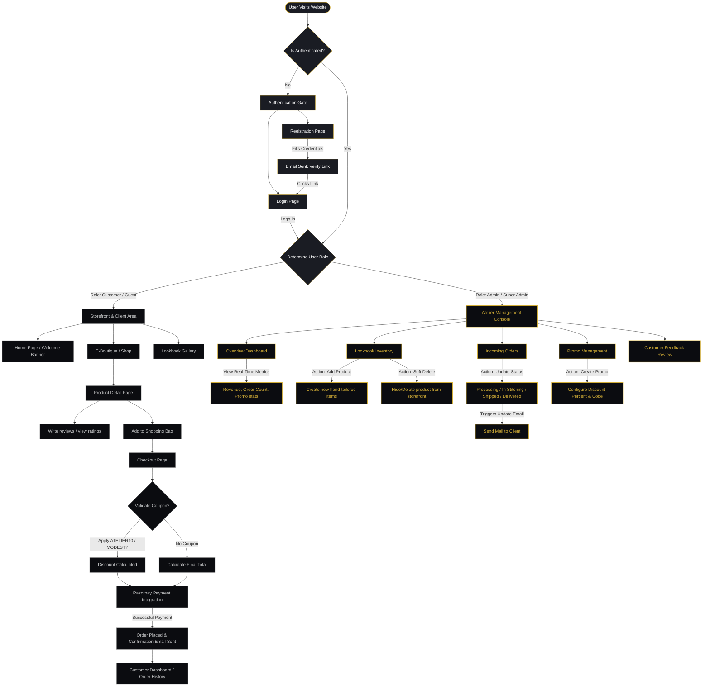

# Abaya By Tabassum — Website Mindmap & User Flow

This document outlines the visual structure and user flow of the **Abaya by Tabassum** platform, showcasing the entry points, the functional branches for both **Customers** and **Administrators**, and how the frontend interacts with the standalone backend.

---

## System Flow Diagram

The following diagram maps the user journey starting from the main authentication screen:

---

## Role-Based Feature Map

| Feature Area | Customer Capabilities | Administrator / Super Admin Capabilities |
| :--- | :--- | :--- |
| **Authentication** | Register an account, log in, verify email, reset forgotten password. | Log in to access the secure administrative workspace. |
| **Storefront** | Browse products, search collections, view lookbooks, view rating details. | Pre-view active products; add products; soft-delete existing products. |
| **Order Flow** | Add items to shopping cart, validate coupons, pay via Razorpay. | View all incoming orders, update status (Stitching, Shipped, Delivered). |
| **Reviews** | Write a review with star ratings (1-5) and comments. | Review and inspect customer feedback comments. |
| **Notifications** | Receive order receipt emails, shipping notifications, and password resets. | Send email updates automatically through status changes. |
